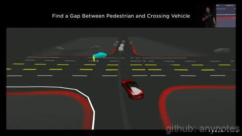
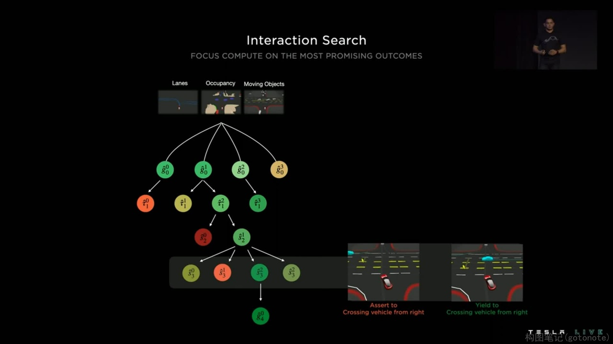
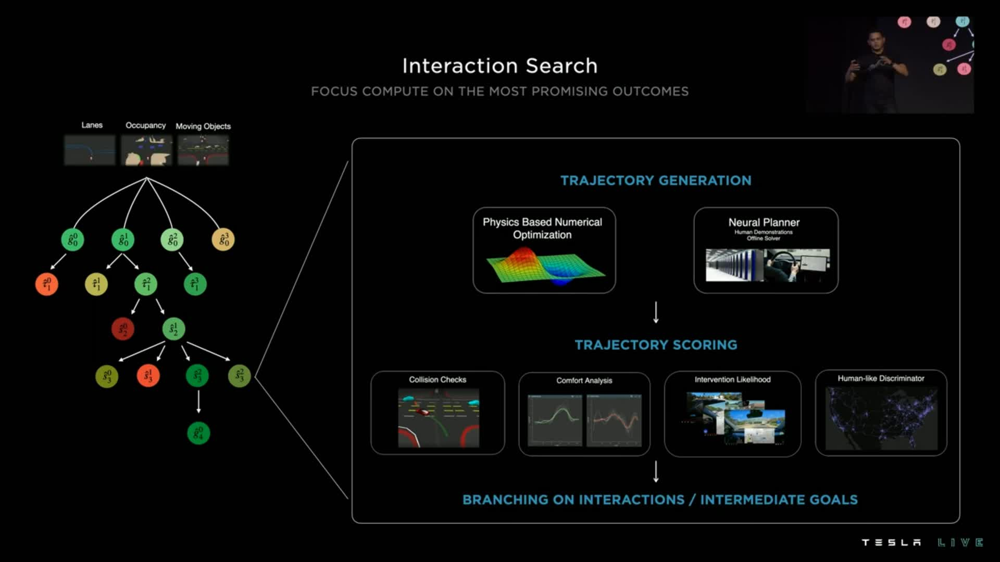

# 路径以及运动规划算法

有关路径规划介绍请参考[这里](../../ch05_%E7%AD%96%E7%95%A5%E8%A7%84%E5%88%92/)，简单来说，场景越复杂，路径以及运动规划更难，当前很多智能驾驶的使用场景基本都在高速环路等半封闭的场景。

此次特斯拉AI DAY分享了自动驾驶最难的场景之一，也是最考验路径规划的场景---拥堵十字路口，前方道路有行人横穿和行车占道通行的情况下，路径以及运动规划如何进行安全舒适的无保护左转，场景如下图1所示：

图1. 拥堵十字路口 

遇到上图1所示场景，一般处理的方式有：

- 坚持自己的路径，让其他车辆，行人等交通参与者让自己。
- 在行人和汽车等交通参与者中间找到空隙行驶。
- 礼让汽车和行人，等他们走了，再走。

相对应的运算步骤如下：

（1）对当前场景下所有交通参与者进行运动轨迹预测；

（2）基于各个轨迹的成本以及约束进行计算；

（3）让本车以及其他交通参与者的运动轨迹进行交互。

  特斯拉表示这个运算过程大概耗时10ms，一般一个拥堵的十字路口左转场景，会有超过20个交互相关的交通参与者，有超过100种交互相关组合，那么目标路径规划时间大概是50ms。

**特斯拉FSD交互搜索算法（Interaction Search）**

图2. 交互相关组合

该算法主要分为五步：

（1）视觉环境识别

  采用稀疏抽取的方法抽取潜在特征来识别车道，障碍物，移动物体等交通参与者。

（2）选定目标候选人

  确定车道线，非结构化区域来形成可通行的空间信息。

（3）产生可能的轨迹

  通过轨迹优化，神经元规划生成运动轨迹。

（4）产生运动方案

  例如到底是强行插入交通还是等待行人通行。

（5）确定轨迹和时间，速度

  当确定好运动方案时候，还需要考虑运动轨迹下的其他车辆通行情况，多种考虑之后才能输出运动规划。

特斯拉表示第5步，是最难的，因为随着每一步约束的增加，每一种新的轨迹生成运算都需要1-5ms，那么你想想这种情况下大约有一百多种方案，那么显然都快需要0.5s的时间用来运算了。

特斯拉想到的方案是lightweight queryable networks轻量化可查询的神经元算法，这种算法是去查找基于其人类驾驶方法场景库以及线下虚拟仿真运算出的结论，也就是查找库已有方案，看他的运动轨迹会怎么做，这样可以在大约100us，也就是0.1ms内来生成一种轨迹。

图3. 交互搜索算法框架

有了多种轨迹和运动规划之后，接下来还需要选择一种，这个时候特斯拉算法采取对碰撞检查，控制舒适性，需要介入的可能性，是否拟人化等多项要求，进行打分来确定，选定最终轨迹和运动规划。

以上就是特斯拉利用其路径规划算法，在解决交通繁忙条件下无保护左转采用的交互搜寻算法，寻找最优的结果的流程。这里一个比较妙的方法是特斯拉有一个人类驾驶行为和仿真参考库提供检索。
